# Mode Sequence Diagrams — Keg Washer

One diagram per mode. Left column "Actuators used" (no border, mirrored vertically) + right column "Steps" (normal boxes). Identical repeated cycles are grouped in a subgraph (e.g. "Detergent cycle") rather than duplicated visually in a loop.

Firmware reference: `MODES[]` in `kegwasher.ino`.

> For a description of each mode (use case, when to use it), see the [User Manual](USER_MANUAL.md).

## Table of Contents

1. [Wash + CO2](#1--wash--co2)
2. [Wash without CO2](#2--wash-without-co2)
3. [Detergent only](#3--detergent-only)
4. [CO2](#4--co2)
5. [Sanitization + CO2](#5--sanitization--co2)
6. [Keg drain](#6--keg-drain)
7. [Sanitizer drain](#7--sanitizer-drain)
8. [Detergent drain](#8--detergent-drain)
9. [Sanitizer fill](#9--sanitizer-fill)
10. [Detergent fill](#10--detergent-fill)
11. [Valve test](#11--valve-test)

---

## 1 — Wash + CO2

Source: `STEPS_WASH_KEG_PRESSURIZE` — ≈ 5 min 35

```mermaid
flowchart TD
    subgraph ACTUATORS["Actuators used"]
    direction TD
        A(["Actuators<br/>at rest"])
        B("DRAIN")
        C("PUMP&nbsp;+&nbsp;WATER&nbsp;+&nbsp;DRAIN<br/>AIR&nbsp;+&nbsp;DRAIN")
        D("PUMP&nbsp;+&nbsp;WATER&nbsp;+&nbsp;DRAIN<br/>CO2&nbsp;+&nbsp;DRAIN<br/>CO2")
        E(["Actuators<br/>at rest"])
        subgraph CL["&nbsp;"]
            direction TB
            CL1("PUMP&nbsp;+&nbsp;CLEANER_IN&nbsp;+&nbsp;CLEANER_OUT<br/>AIR&nbsp;+&nbsp;CLEANER_OUT")
            CL2("PUMP&nbsp;+&nbsp;CLEANER_IN&nbsp;+&nbsp;CLEANER_OUT<br/>AIR&nbsp;+&nbsp;CLEANER_OUT")
            CL3("PUMP&nbsp;+&nbsp;CLEANER_IN&nbsp;+&nbsp;CLEANER_OUT<br/>AIR&nbsp;+&nbsp;CLEANER_OUT")
            CL1 ~~~ CL2 ~~~ CL3
        end
        subgraph RI["&nbsp;"]
            direction TB
            RI1("PUMP&nbsp;+&nbsp;WATER&nbsp;+&nbsp;DRAIN<br/>AIR&nbsp;+&nbsp;DRAIN")
            RI2("PUMP&nbsp;+&nbsp;WATER&nbsp;+&nbsp;DRAIN<br/>AIR&nbsp;+&nbsp;DRAIN")
            RI3("PUMP&nbsp;+&nbsp;WATER&nbsp;+&nbsp;DRAIN<br/>AIR&nbsp;+&nbsp;DRAIN")
            RI1 ~~~ RI2 ~~~ RI3
        end
        subgraph SA["&nbsp;"]
            direction TB
            SA1("PUMP&nbsp;+&nbsp;SANITIZER_IN&nbsp;+&nbsp;SANITIZER_OUT<br/>AIR&nbsp;+&nbsp;SANITIZER_OUT")
            SA2("PUMP&nbsp;+&nbsp;SANITIZER_IN&nbsp;+&nbsp;SANITIZER_OUT<br/>AIR&nbsp;+&nbsp;SANITIZER_OUT")
            SA3("PUMP&nbsp;+&nbsp;SANITIZER_IN&nbsp;+&nbsp;SANITIZER_OUT<br/>AIR&nbsp;+&nbsp;SANITIZER_OUT")
            SA1 ~~~ SA2 ~~~ SA3
        end
        A ~~~ |&nbsp;| B ~~~ C
        C ~~~ CL1
        CL3 ~~~ RI1
        RI3 ~~~ SA1
        SA3 ~~~ D
        D ~~~ E
    end
    style ACTUATORS fill:none,stroke:none
    style CL fill:none,stroke:none
    style RI fill:none,stroke:none
    style SA fill:none,stroke:none
    style B fill:none,stroke:none
    style C fill:none,stroke:none
    style D fill:none,stroke:none
    style CL1 fill:none,stroke:none
    style CL2 fill:none,stroke:none
    style CL3 fill:none,stroke:none
    style RI1 fill:none,stroke:none
    style RI2 fill:none,stroke:none
    style RI3 fill:none,stroke:none
    style SA1 fill:none,stroke:none
    style SA2 fill:none,stroke:none
    style SA3 fill:none,stroke:none
    subgraph STEPS["Mode Wash + CO2"]
        direction TB
        Start(["Mode selected<br/>Wash + CO₂"])
        Drain["Drain 10 s"]
        Rinse0["Initial rinse 10 s<br/>Purge 20 s"]
        subgraph CLEAN["Detergent cycle"]
            direction TB
            C1["Detergent 10 s<br/>Purge 15 s"]
            C2["Detergent 10 s<br/>Purge 15 s"]
            C3["Detergent 10 s<br/>Purge 20 s"]
            C1 --> C2 --> C3
        end
        subgraph RINSE["Intermediate rinse"]
            direction TB
            R1["Rinse 3 s<br/>Purge 10 s"]
            R2["Rinse 7 s<br/>Purge 10 s"]
            R3["Rinse 10 s<br/>Purge 20 s"]
            R1 --> R2 --> R3
        end
        subgraph SAN["Sanitization cycle"]
            direction TB
            S1["Sanitizer 10 s<br/>Purge 15 s"]
            S2["Sanitizer 10 s<br/>Purge 15 s"]
            S3["Sanitizer 30 s<br/>Purge 20 s"]
            S1 --> S2 --> S3
        end
        Final["Final rinse 10 s<br/>CO2 purge 30 s<br/>CO2 pressurisation 10 s"]
        End(["Cycle complete<br/>3 beeps"])
        Start -->|Button press| Drain
        Drain --> Rinse0
        Rinse0 --> C1
        C3 --> R1
        R3 --> S1
        S3 --> Final
        Final --> End
    end
```

---

## 2 — Wash without CO2

Source: `STEPS_WASH_KEG` — ≈ 5 min 25

```mermaid
flowchart TD
    subgraph ACTUATORS["Actuators used"]
    direction TD
        A(["Actuators<br/>at rest"])
        B("DRAIN")
        C("PUMP&nbsp;+&nbsp;WATER&nbsp;+&nbsp;DRAIN<br/>AIR&nbsp;+&nbsp;DRAIN")
        D("PUMP&nbsp;+&nbsp;WATER&nbsp;+&nbsp;DRAIN<br/>AIR&nbsp;+&nbsp;DRAIN")
        E(["Actuators<br/>at rest"])
        subgraph CL["&nbsp;"]
            direction TB
            CL1("PUMP&nbsp;+&nbsp;CLEANER_IN&nbsp;+&nbsp;CLEANER_OUT<br/>AIR&nbsp;+&nbsp;CLEANER_OUT")
            CL2("PUMP&nbsp;+&nbsp;CLEANER_IN&nbsp;+&nbsp;CLEANER_OUT<br/>AIR&nbsp;+&nbsp;CLEANER_OUT")
            CL3("PUMP&nbsp;+&nbsp;CLEANER_IN&nbsp;+&nbsp;CLEANER_OUT<br/>AIR&nbsp;+&nbsp;CLEANER_OUT")
            CL1 ~~~ CL2 ~~~ CL3
        end
        subgraph RI["&nbsp;"]
            direction TB
            RI1("PUMP&nbsp;+&nbsp;WATER&nbsp;+&nbsp;DRAIN<br/>AIR&nbsp;+&nbsp;DRAIN")
            RI2("PUMP&nbsp;+&nbsp;WATER&nbsp;+&nbsp;DRAIN<br/>AIR&nbsp;+&nbsp;DRAIN")
            RI3("PUMP&nbsp;+&nbsp;WATER&nbsp;+&nbsp;DRAIN<br/>AIR&nbsp;+&nbsp;DRAIN")
            RI1 ~~~ RI2 ~~~ RI3
        end
        subgraph SA["&nbsp;"]
            direction TB
            SA1("PUMP&nbsp;+&nbsp;SANITIZER_IN&nbsp;+&nbsp;SANITIZER_OUT<br/>AIR&nbsp;+&nbsp;SANITIZER_OUT")
            SA2("PUMP&nbsp;+&nbsp;SANITIZER_IN&nbsp;+&nbsp;SANITIZER_OUT<br/>AIR&nbsp;+&nbsp;SANITIZER_OUT")
            SA3("PUMP&nbsp;+&nbsp;SANITIZER_IN&nbsp;+&nbsp;SANITIZER_OUT<br/>AIR&nbsp;+&nbsp;SANITIZER_OUT")
            SA1 ~~~ SA2 ~~~ SA3
        end
        A ~~~ |&nbsp;| B ~~~ C
        C ~~~ CL1
        CL3 ~~~ RI1
        RI3 ~~~ SA1
        SA3 ~~~ D
        D ~~~ E
    end
    style ACTUATORS fill:none,stroke:none
    style CL fill:none,stroke:none
    style RI fill:none,stroke:none
    style SA fill:none,stroke:none
    style B fill:none,stroke:none
    style C fill:none,stroke:none
    style D fill:none,stroke:none
    style CL1 fill:none,stroke:none
    style CL2 fill:none,stroke:none
    style CL3 fill:none,stroke:none
    style RI1 fill:none,stroke:none
    style RI2 fill:none,stroke:none
    style RI3 fill:none,stroke:none
    style SA1 fill:none,stroke:none
    style SA2 fill:none,stroke:none
    style SA3 fill:none,stroke:none
    subgraph STEPS["Mode Wash without CO2"]
        direction TB
        Start(["Mode selected<br/>Wash without CO₂"])
        Drain["Drain 10 s"]
        Rinse0["Initial rinse 10 s<br/>Purge 20 s"]
        subgraph CLEAN["Detergent cycle"]
            direction TB
            C1["Detergent 10 s<br/>Purge 15 s"]
            C2["Detergent 10 s<br/>Purge 15 s"]
            C3["Detergent 10 s<br/>Purge 20 s"]
            C1 --> C2 --> C3
        end
        subgraph RINSE["Intermediate rinse"]
            direction TB
            R1["Rinse 3 s<br/>Purge 10 s"]
            R2["Rinse 7 s<br/>Purge 10 s"]
            R3["Rinse 10 s<br/>Purge 20 s"]
            R1 --> R2 --> R3
        end
        subgraph SAN["Sanitization cycle"]
            direction TB
            S1["Sanitizer 10 s<br/>Purge 15 s"]
            S2["Sanitizer 10 s<br/>Purge 15 s"]
            S3["Sanitizer 30 s<br/>Purge 20 s"]
            S1 --> S2 --> S3
        end
        Final["Final rinse 10 s<br/>Air purge 30 s"]
        End(["Cycle complete<br/>3 beeps"])
        Start -->|Button press| Drain
        Drain --> Rinse0
        Rinse0 --> C1
        C3 --> R1
        R3 --> S1
        S3 --> Final
        Final --> End
    end
```

---

## 3 — Detergent only

Source: `STEPS_DETER_KEG` — ≈ 3 min 00. No sanitization cycle, no separate final rinse: the intermediate rinse cycle ends the mode directly.

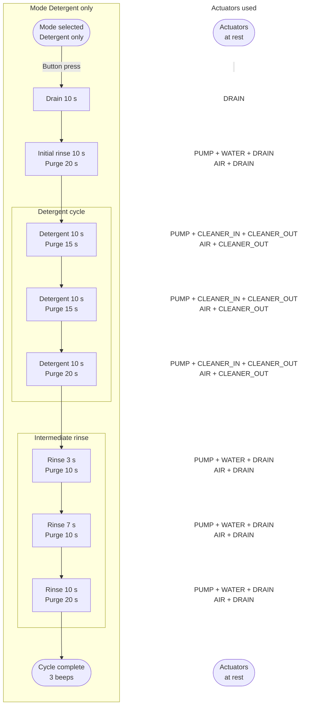

---

## 4 — CO2

Source: `STEPS_KEG_PRESSURIZE` — 50 s. Shortest mode, purely linear.

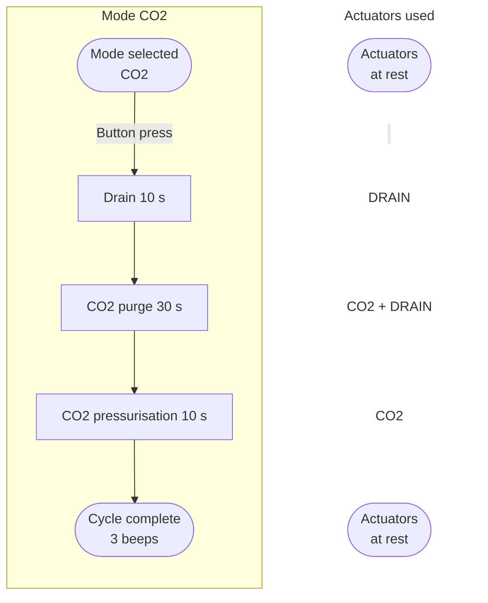

---

## 5 — Sanitization + CO2

Source: `STEPS_SANITIZE_KEG_PRESSURIZE` — ≈ 3 min 10

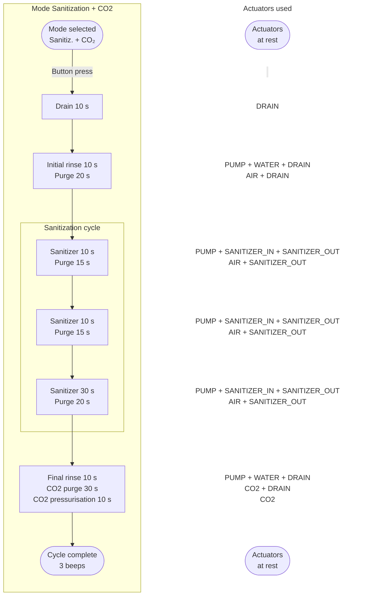

---

## 6 — Keg drain

Source: `STEPS_DRAIN_KEG` — 70 s

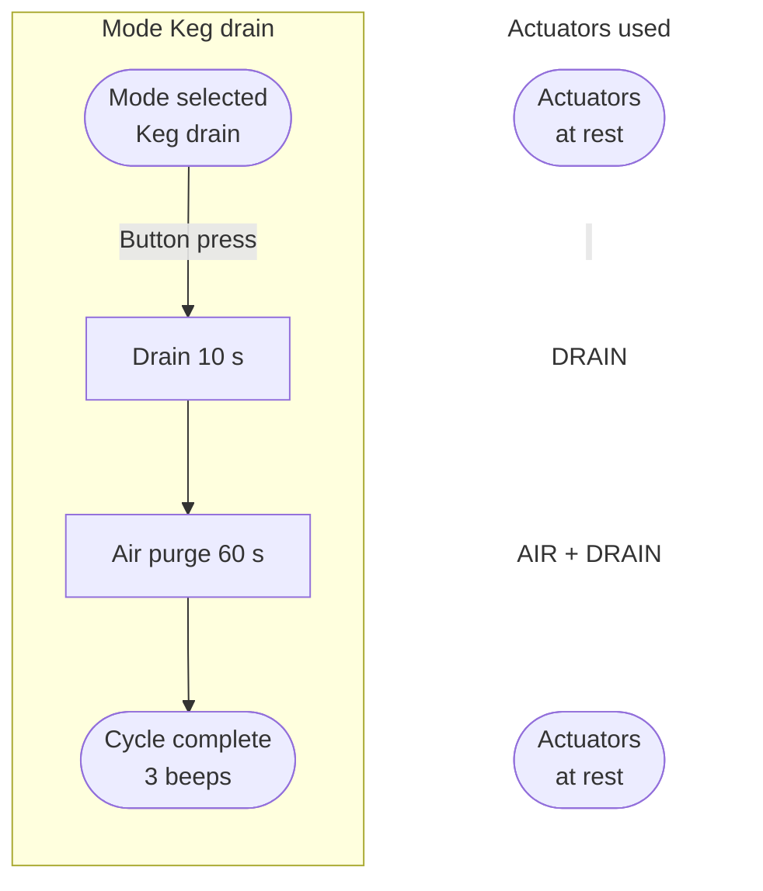

---

## 7 — Sanitizer drain

Source: `STEPS_DRAIN_SANITIZER` — 200 s, single step.

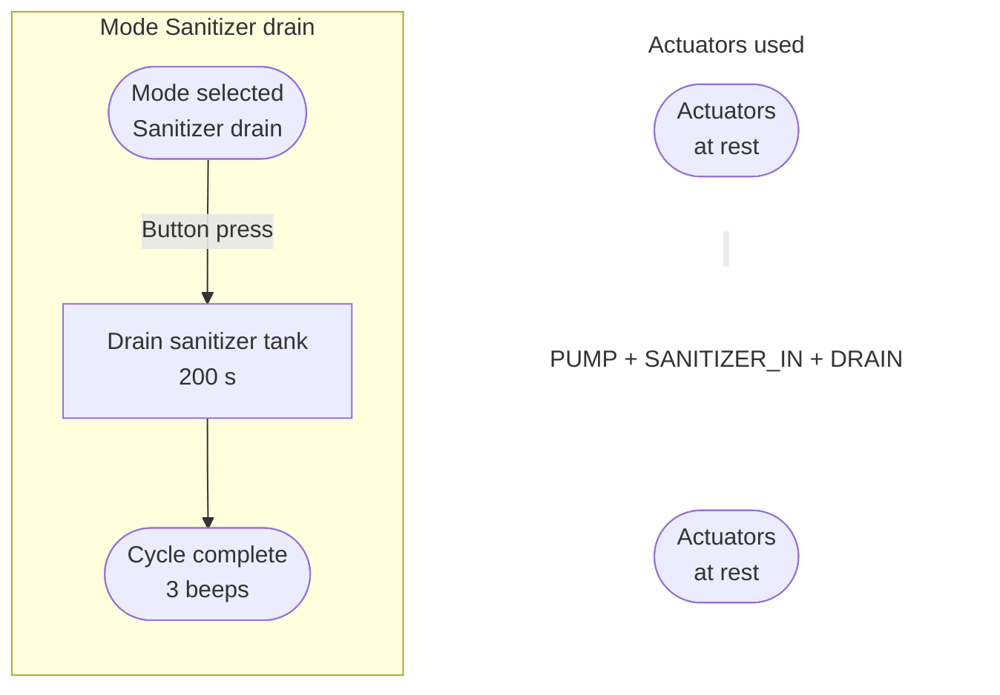

---

## 8 — Detergent drain

Source: `STEPS_DRAIN_CLEANER` — 200 s, single step.

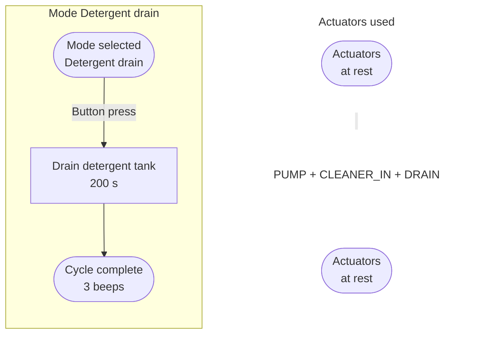

---

## 9 — Sanitizer fill

Source: `STEPS_FILL_SANITIZER` — 120 s, single step.

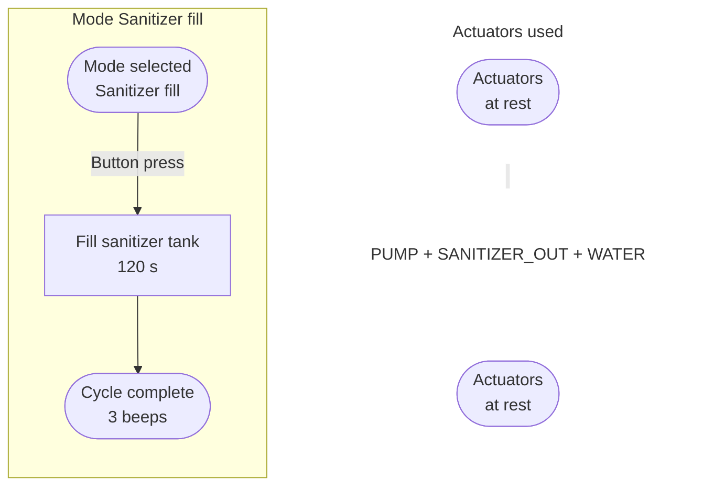

---

## 10 — Detergent fill

Source: `STEPS_FILL_CLEANER` — 120 s, single step.

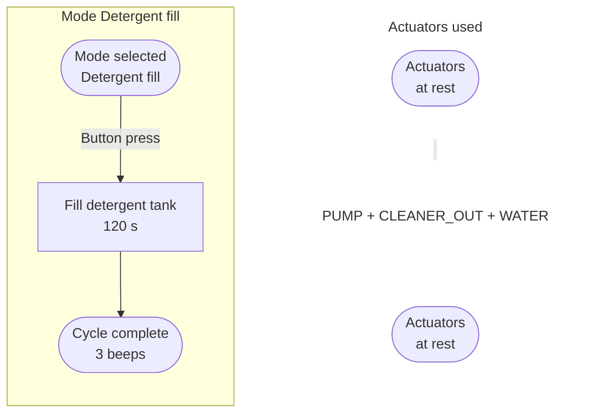

---

## 11 — Valve test

Source: `STEPS_TEST_ACTUATORS` — 24 s.

**Template exception:** this mode does not follow the two-column layout. Each step activates a *different* actuator (no repeated identical block), so the "Actuators" column would be redundant with the step name itself. Single-column diagram, purely sequential.

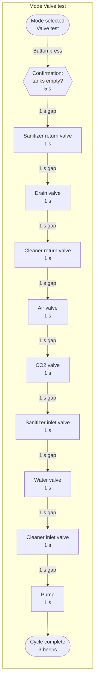

**Note valid for all 11 modes:** pressing the button during execution cancels the running sequence (valves close, 1 beep, return to selection screen) — not shown on each diagram to avoid clutter.
