# GRAFCET des modes — Keg Washer

Un diagramme par mode. Colonne de gauche « Actionneurs utilisés » (sans bordure, en miroir vertical) + colonne de droite « Étapes » (boîtes normales). Les cycles identiques répétés sont regroupés dans un sous-graphe (ex. « Cycle détergent ») plutôt que dupliqués visuellement en boucle.

Référence firmware : `MODES[]` dans `kegwasher.ino`.

> Pour la description de chaque mode (cas d'usage, quand l'utiliser), voir le [Manuel d'utilisation](MANUEL_UTILISATION.md).

## Sommaire

1. [Lavage + CO2](#1--lavage--co2)
2. [Lavage sans CO2](#2--lavage-sans-co2)
3. [Détergent seul](#3--détergent-seul)
4. [CO2](#4--co2)
5. [Désinfection + CO2](#5--désinfection--co2)
6. [Vidange fût](#6--vidange-fût)
7. [Vidange désinfectant](#7--vidange-désinfectant)
8. [Vidange détergent](#8--vidange-détergent)
9. [Remplissage désinfectant](#9--remplissage-désinfectant)
10. [Remplissage détergent](#10--remplissage-détergent)
11. [Test vannes](#11--test-vannes)

---

## 1 — Lavage + CO2

Source : `STEPS_WASH_KEG_PRESSURIZE` — ≈ 5 min 30

```mermaid
flowchart TD
    subgraph ACTUATORS["Actionneurs utilisés"]
    direction TD
        A(["Actionneurs<br/>au repos"])
        B("EGOUT")
        C("POMPE&nbsp;+&nbsp;EAU&nbsp;+&nbsp;EGOUT<br/>AIR&nbsp;+&nbsp;EGOUT")
        D("POMPE&nbsp;+&nbsp;EAU&nbsp;+&nbsp;EGOUT<br/>CO2&nbsp;+&nbsp;EGOUT<br/>CO2")
        E(["Actionneurs<br/>au repos"])
        subgraph CL["&nbsp;"]
            direction TB
            CL1("POMPE&nbsp;+&nbsp;DETERG_IN&nbsp;+&nbsp;DETERG_OUT<br/>AIR&nbsp;+&nbsp;DETERG_OUT")
            CL2("POMPE&nbsp;+&nbsp;DETERG_IN&nbsp;+&nbsp;DETERG_OUT<br/>AIR&nbsp;+&nbsp;DETERG_OUT")
            CL3("POMPE&nbsp;+&nbsp;DETERG_IN&nbsp;+&nbsp;DETERG_OUT<br/>AIR&nbsp;+&nbsp;DETERG_OUT")
            CL1 ~~~ CL2 ~~~ CL3
        end
        subgraph RI["&nbsp;"]
            direction TB
            RI1("POMPE&nbsp;+&nbsp;EAU&nbsp;+&nbsp;EGOUT<br/>AIR&nbsp;+&nbsp;EGOUT")
            RI2("POMPE&nbsp;+&nbsp;EAU&nbsp;+&nbsp;EGOUT<br/>AIR&nbsp;+&nbsp;EGOUT")
            RI3("POMPE&nbsp;+&nbsp;EAU&nbsp;+&nbsp;EGOUT<br/>AIR&nbsp;+&nbsp;EGOUT")
            RI1 ~~~ RI2 ~~~ RI3
        end
        subgraph SA["&nbsp;"]
            direction TB
            SA1("POMPE&nbsp;+&nbsp;DESINF_IN&nbsp;+&nbsp;DESINF_OUT<br/>AIR&nbsp;+&nbsp;DESINF_OUT")
            SA2("POMPE&nbsp;+&nbsp;DESINF_IN&nbsp;+&nbsp;DESINF_OUT<br/>AIR&nbsp;+&nbsp;DESINF_OUT")
            SA3("POMPE&nbsp;+&nbsp;DESINF_IN&nbsp;+&nbsp;DESINF_OUT<br/>AIR&nbsp;+&nbsp;DESINF_OUT")
            SA1 ~~~ SA2 ~~~ SA3
        end
        A ~~~ |&nbsp;| B ~~~ C
        C ~~~ CL1
        CL3 ~~~ RI1
        RI3 ~~~ SA1
        SA3 ~~~ D
        D ~~~ E
    end
    style ACTUATORS fill:none,stroke:none
    style CL fill:none,stroke:none
    style RI fill:none,stroke:none
    style SA fill:none,stroke:none
    style B fill:none,stroke:none
    style C fill:none,stroke:none
    style D fill:none,stroke:none
    style CL1 fill:none,stroke:none
    style CL2 fill:none,stroke:none
    style CL3 fill:none,stroke:none
    style RI1 fill:none,stroke:none
    style RI2 fill:none,stroke:none
    style RI3 fill:none,stroke:none
    style SA1 fill:none,stroke:none
    style SA2 fill:none,stroke:none
    style SA3 fill:none,stroke:none
    subgraph STEPS["Mode Lavage + CO2"]
        direction TB
        Start(["Sélection du mode<br/>Lavage + CO₂"])
        Drain["Vidange 10 s"]
        Rinse0["Rinçage initial 10 s<br/>Purge 20 s"]
        subgraph CLEAN["Cycle détergent"]
            direction TB
            C1["Détergent 10 s<br/>Purge 15 s"]
            C2["Détergent 10 s<br/>Purge 15 s"]
            C3["Détergent 10 s<br/>Purge 20 s"]
            C1 --> C2 --> C3
        end
        subgraph RINSE["Rinçage intermédiaire"]
            direction TB
            R1["Rinçage 3 s<br/>Purge 10 s"]
            R2["Rinçage 7 s<br/>Purge 10 s"]
            R3["Rinçage 10 s<br/>Purge 20 s"]
            R1 --> R2 --> R3
        end
        subgraph SAN["Cycle désinfection"]
            direction TB
            S1["Désinfectant 10 s<br/>Purge 15 s"]
            S2["Désinfectant 10 s<br/>Purge 15 s"]
            S3["Désinfectant 30 s<br/>Purge 20 s"]
            S1 --> S2 --> S3
        end
        Final["Rinçage final 10 s<br/>Purge CO2 30 s<br/>Pressurisation CO2 10 s"]
        End(["Fin de cycle<br/>3 bips"])
        Start -->|Appui bouton| Drain
        Drain --> Rinse0
        Rinse0 --> C1
        C3 --> R1
        R3 --> S1
        S3 --> Final
        Final --> End
    end
```

---

## 2 — Lavage sans CO2

Source : `STEPS_WASH_KEG` — ≈ 5 min 20

```mermaid
flowchart TD
    subgraph ACTUATORS["Actionneurs utilisés"]
    direction TD
        A(["Actionneurs<br/>au repos"])
        B("EGOUT")
        C("POMPE&nbsp;+&nbsp;EAU&nbsp;+&nbsp;EGOUT<br/>AIR&nbsp;+&nbsp;EGOUT")
        D("POMPE&nbsp;+&nbsp;EAU&nbsp;+&nbsp;EGOUT<br/>AIR&nbsp;+&nbsp;EGOUT")
        E(["Actionneurs<br/>au repos"])
        subgraph CL["&nbsp;"]
            direction TB
            CL1("POMPE&nbsp;+&nbsp;DETERG_IN&nbsp;+&nbsp;DETERG_OUT<br/>AIR&nbsp;+&nbsp;DETERG_OUT")
            CL2("POMPE&nbsp;+&nbsp;DETERG_IN&nbsp;+&nbsp;DETERG_OUT<br/>AIR&nbsp;+&nbsp;DETERG_OUT")
            CL3("POMPE&nbsp;+&nbsp;DETERG_IN&nbsp;+&nbsp;DETERG_OUT<br/>AIR&nbsp;+&nbsp;DETERG_OUT")
            CL1 ~~~ CL2 ~~~ CL3
        end
        subgraph RI["&nbsp;"]
            direction TB
            RI1("POMPE&nbsp;+&nbsp;EAU&nbsp;+&nbsp;EGOUT<br/>AIR&nbsp;+&nbsp;EGOUT")
            RI2("POMPE&nbsp;+&nbsp;EAU&nbsp;+&nbsp;EGOUT<br/>AIR&nbsp;+&nbsp;EGOUT")
            RI3("POMPE&nbsp;+&nbsp;EAU&nbsp;+&nbsp;EGOUT<br/>AIR&nbsp;+&nbsp;EGOUT")
            RI1 ~~~ RI2 ~~~ RI3
        end
        subgraph SA["&nbsp;"]
            direction TB
            SA1("POMPE&nbsp;+&nbsp;DESINF_IN&nbsp;+&nbsp;DESINF_OUT<br/>AIR&nbsp;+&nbsp;DESINF_OUT")
            SA2("POMPE&nbsp;+&nbsp;DESINF_IN&nbsp;+&nbsp;DESINF_OUT<br/>AIR&nbsp;+&nbsp;DESINF_OUT")
            SA3("POMPE&nbsp;+&nbsp;DESINF_IN&nbsp;+&nbsp;DESINF_OUT<br/>AIR&nbsp;+&nbsp;DESINF_OUT")
            SA1 ~~~ SA2 ~~~ SA3
        end
        A ~~~ |&nbsp;| B ~~~ C
        C ~~~ CL1
        CL3 ~~~ RI1
        RI3 ~~~ SA1
        SA3 ~~~ D
        D ~~~ E
    end
    style ACTUATORS fill:none,stroke:none
    style CL fill:none,stroke:none
    style RI fill:none,stroke:none
    style SA fill:none,stroke:none
    style B fill:none,stroke:none
    style C fill:none,stroke:none
    style D fill:none,stroke:none
    style CL1 fill:none,stroke:none
    style CL2 fill:none,stroke:none
    style CL3 fill:none,stroke:none
    style RI1 fill:none,stroke:none
    style RI2 fill:none,stroke:none
    style RI3 fill:none,stroke:none
    style SA1 fill:none,stroke:none
    style SA2 fill:none,stroke:none
    style SA3 fill:none,stroke:none
    subgraph STEPS["Mode Lavage sans CO2"]
        direction TB
        Start(["Sélection du mode<br/>Lavage sans CO₂"])
        Drain["Vidange 10 s"]
        Rinse0["Rinçage initial 10 s<br/>Purge 20 s"]
        subgraph CLEAN["Cycle détergent"]
            direction TB
            C1["Détergent 10 s<br/>Purge 15 s"]
            C2["Détergent 10 s<br/>Purge 15 s"]
            C3["Détergent 10 s<br/>Purge 20 s"]
            C1 --> C2 --> C3
        end
        subgraph RINSE["Rinçage intermédiaire"]
            direction TB
            R1["Rinçage 3 s<br/>Purge 10 s"]
            R2["Rinçage 7 s<br/>Purge 10 s"]
            R3["Rinçage 10 s<br/>Purge 20 s"]
            R1 --> R2 --> R3
        end
        subgraph SAN["Cycle désinfection"]
            direction TB
            S1["Désinfectant 10 s<br/>Purge 15 s"]
            S2["Désinfectant 10 s<br/>Purge 15 s"]
            S3["Désinfectant 30 s<br/>Purge 20 s"]
            S1 --> S2 --> S3
        end
        Final["Rinçage final 10 s<br/>Purge 30 s"]
        End(["Fin de cycle<br/>3 bips"])
        Start -->|Appui bouton| Drain
        Drain --> Rinse0
        Rinse0 --> C1
        C3 --> R1
        R3 --> S1
        S3 --> Final
        Final --> End
    end
```

---

## 3 — Détergent seul

Source : `STEPS_DETER_KEG` — ≈ 3 min 00. Pas de cycle désinfection, pas de rinçage final séparé : le cycle de rinçage intermédiaire termine directement le mode.

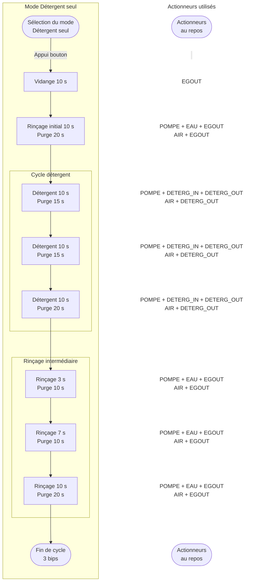

---

## 4 — CO2

Source : `STEPS_KEG_PRESSURIZE` — 50 s. Mode le plus court, purement linéaire.

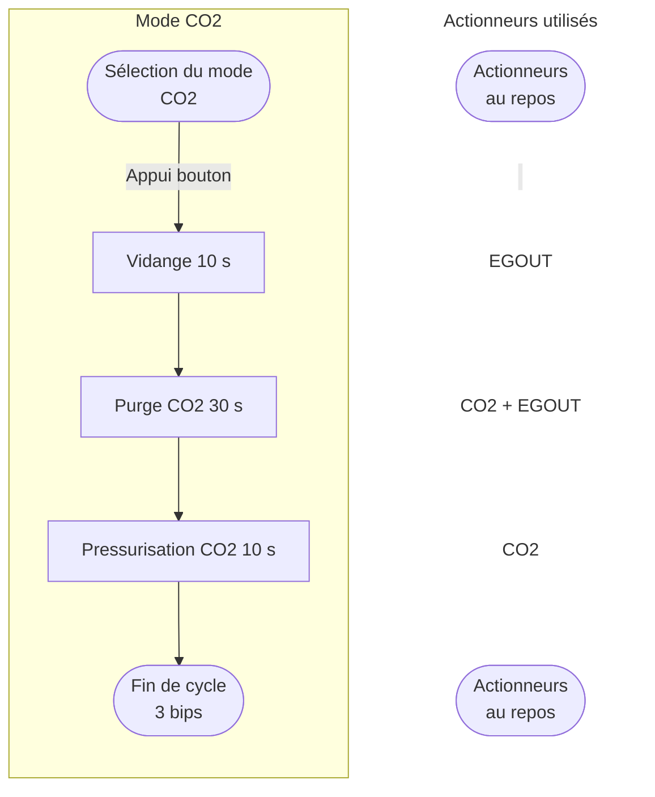

---

## 5 — Désinfection + CO2

Source : `STEPS_SANITIZE_KEG_PRESSURIZE` — ≈ 3 min 10

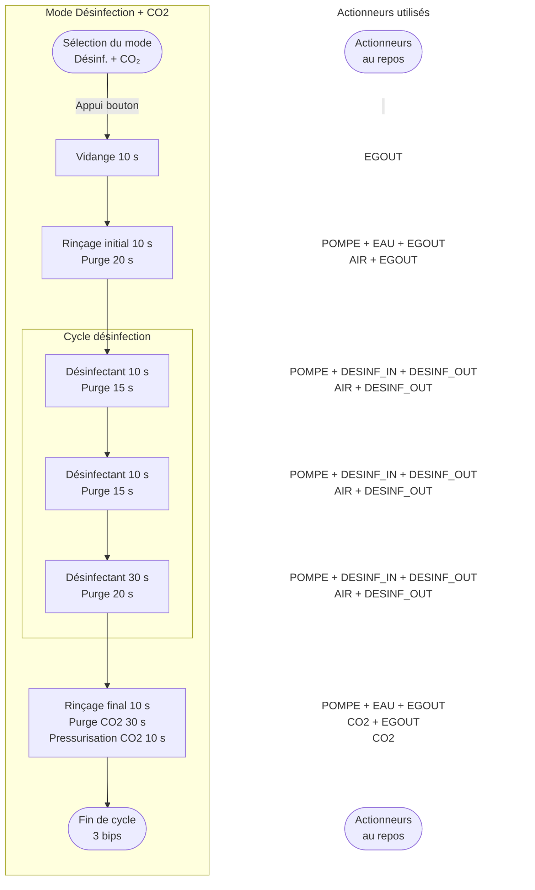

---

## 6 — Vidange fût

Source : `STEPS_DRAIN_KEG` — 70 s

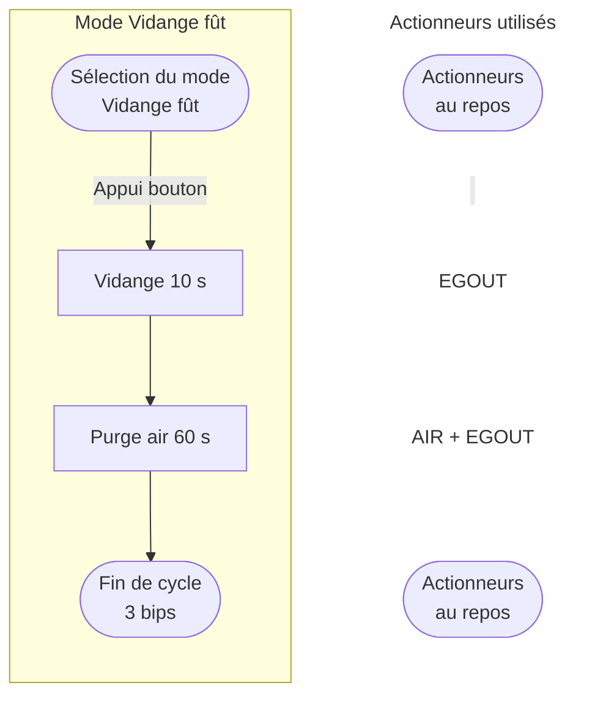

---

## 7 — Vidange désinfectant

Source : `STEPS_DRAIN_SANITIZER` — 200 s, une seule étape.

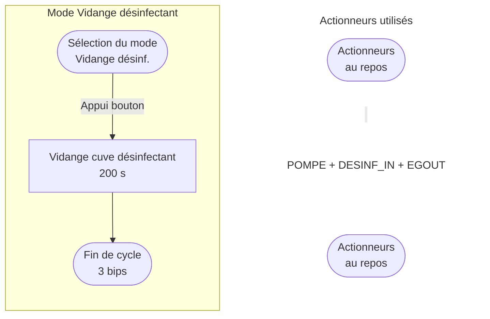

---

## 8 — Vidange détergent

Source : `STEPS_DRAIN_CLEANER` — 200 s, une seule étape.

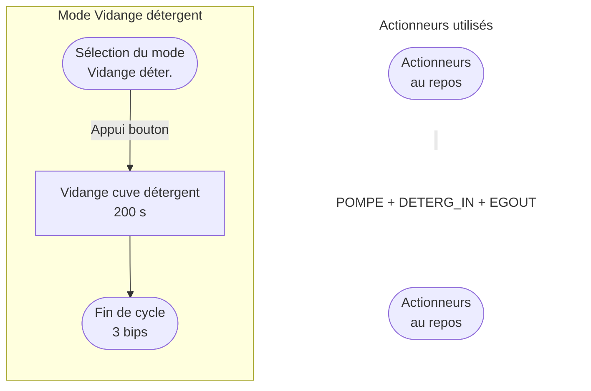

---

## 9 — Remplissage désinfectant

Source : `STEPS_FILL_SANITIZER` — 120 s, une seule étape.

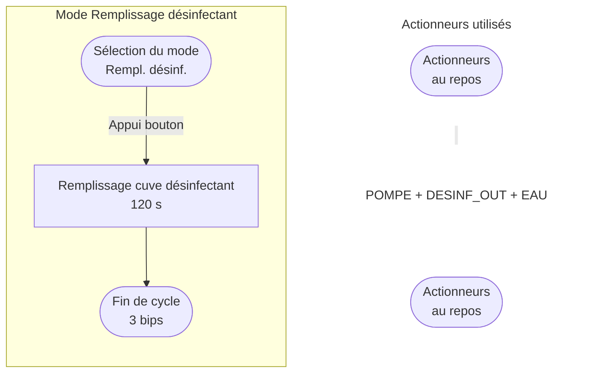

---

## 10 — Remplissage détergent

Source : `STEPS_FILL_CLEANER` — 120 s, une seule étape.

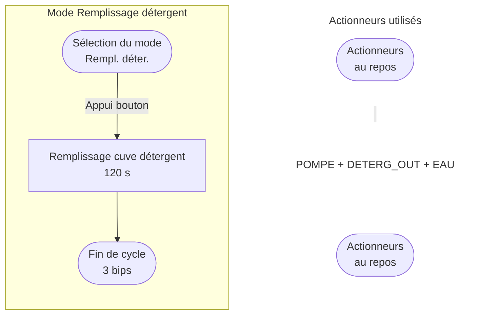

---

## 11 — Test vannes

Source : `STEPS_TEST_ACTUATORS` — 24 s.

**Écart au gabarit :** ce mode ne suit pas le schéma à deux colonnes. Chaque étape active un actionneur *différent* (pas de bloc identique répété), donc la colonne « Actionneurs » serait redondante avec le nom de l'étape elle-même. Diagramme à une seule colonne, purement séquentiel.

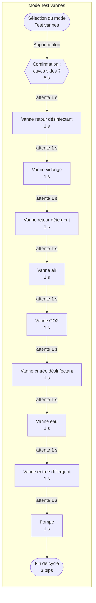

**Note valable pour les 11 modes :** un appui sur le bouton pendant l'exécution annule la séquence en cours (fermeture des vannes, 1 bip, retour à l'écran de sélection) — non représenté sur chaque diagramme pour ne pas les surcharger.
